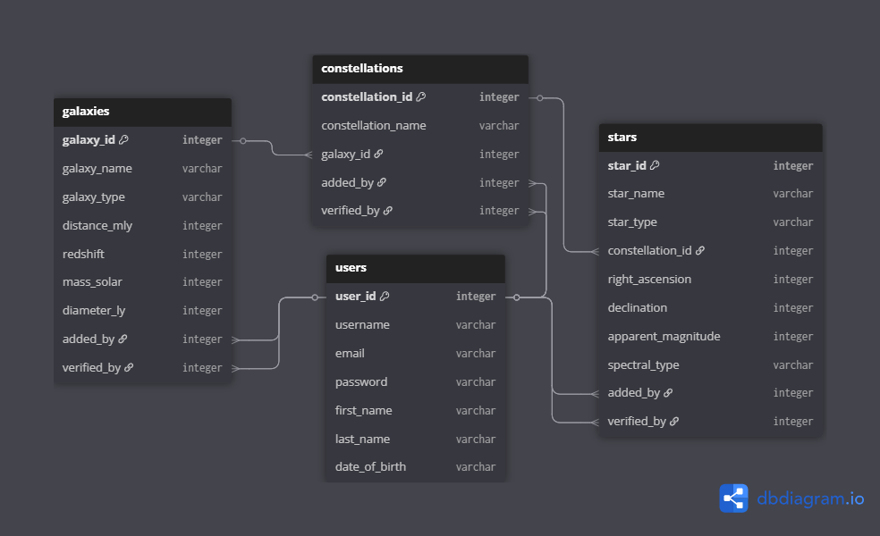
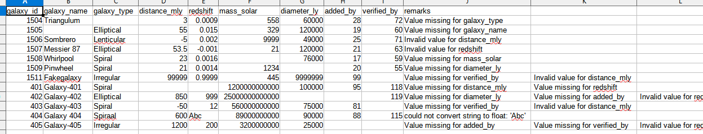
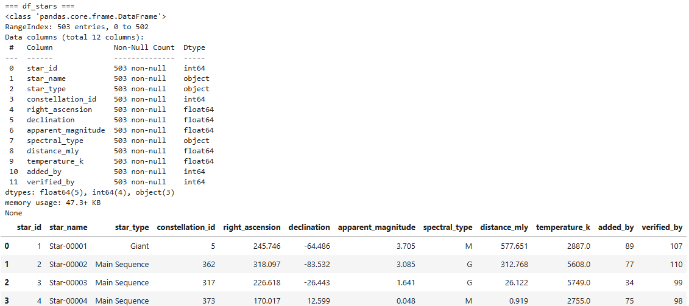
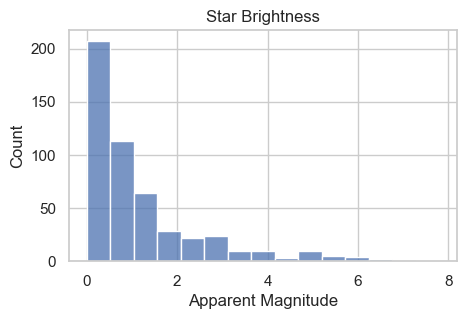
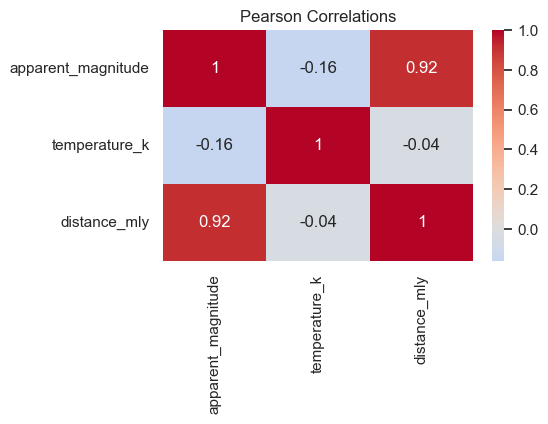
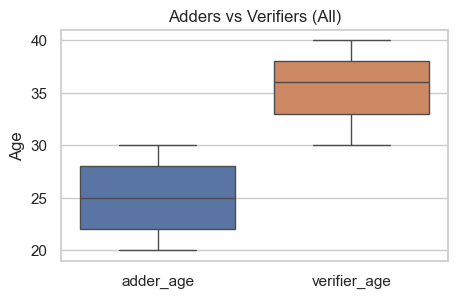

# STARZZ Dashboard  

A statistics-focused Jupyter Notebook project exploring stars, constellations, galaxies, and users.  

This dashboard is part of my STARZZ series, where I practice turning raw datasets into clear insights.  
Unlike my other dashboards that focus on financial KPIs or climate storytelling, this one emphasizes statistics and data cleaning—showing how an analyst can handle messy data, run descriptive and inferential analyses, and present findings visually.  

---

## Project Summary  

This mock dataset simulates challenges common in real-world analysis, combining:  

- Stars (brightness, temperature, distance, type)  
- Constellations (groupings of stars)  
- Galaxies (parent systems of constellations)  
- Users (adders and verifiers, with different roles in the process)  

  

The project demonstrates my ability to:  

1. Clean messy data: handle typos, missing values, and broken references.  
2. Explore descriptively: distributions, correlations, and comparisons.  
3. Apply inferential statistics: regression, hypothesis testing, and group analysis.  
4. Communicate visually: turning raw numbers into clear charts.  

---

## Tools  

- **Jupyter Notebook** (analysis + storytelling)  
- **Pandas** (data manipulation)  
- **Seaborn** (statistical visualization)  

---

## Example Analyses  

- Distribution of star brightness and temperature (histograms, boxplots)  
- Stars per constellation: many small, a few massive clusters  
- Constellations per galaxy: some galaxies packed, others empty  
- Adders vs. verifiers: age distribution and contribution patterns  
- Regression: distance vs. brightness correlation  

---

## Data Quality Note  

To make this realistic, I injected 10–20 intentionally messy rows per table (stars, constellations, galaxies).  
These simulate real-world issues an analyst would face:  

- Typos and case mismatches (e.g., "milky way" vs. "Milky Way")  
- Out-of-range values (negative distances, impossible magnitudes)  
- Missing values (NaN, blanks)  
- Broken references (e.g., star pointing to a non-existent constellation_id)  

I do not attempt to fix every typo, but I do **flag anomalies that break observed business patterns** (e.g., unusually young verifiers, or verifiers who only contribute once).  
In a real-world setting, these would be raised to the data owner for clarification before continuing the analysis.  

---

## Inferential Statistics Note  

This project includes a small section on inferential statistics (ANOVA, Chi-square, correlations, regression). While these methods are more common in *data science*, I added them here to show that I understand when and how they can be applied.  

My primary focus is **data analysis** — framing business problems, exploring data, uncovering insights, and communicating them clearly. The inferential stats notebook is not meant to suggest I’m pursuing a data science role; rather, it demonstrates that I can apply statistical thinking when it strengthens analysis.  

---

## Repository Structure  

starzz-dashboard/  
│  
├── data/  
│   ├── raw/             # raw CSVs with mess  
│   └── flagged/         # messy rows of each CSV  
│   └── cleaned/         # cleaned outputs  
│  
├── notebooks/  
│   ├── 01_raw_data_cleanup.ipynb  
│   ├── 02_eda.ipynb  
│   ├── 03_descriptive_stats.ipynb  
│   ├── 04_inferential_stats.ipynb  
│   └── 05_user_behavior.ipynb  
│  
├── assets/              # screenshots for README  
└── README.md  

---

## Notebook Screenshots  

Each notebook has a representative chart for quick review:  

- `01_raw_data_cleanup.ipynb` → flagged messy rows (example of cleaning step)  
    

- `02_eda.ipynb` → first look (early exploration)  
    

- `03_descriptive_stats.ipynb` → star brightness histogram
    

- `04_inferential_stats.ipynb` → correlation heatmap  
    

- `05_user_behavior.ipynb` → adders vs. verifiers age distribution  
    

---

## How to Run  

This project is built in Jupyter Notebooks with Python 3.x and standard libraries (pandas, numpy, matplotlib, seaborn).  

If you’d like to reproduce the analysis:  

1. Clone this repository.  
2. Install dependencies:

   uv sync  

3. Run notebooks in order:  

   - 01_raw_data_cleanup.ipynb → exports cleaned CSVs  
   - 02_eda.ipynb → for data discovery
   - 03_descriptive_stats.ipynb → for descriptive statistics
   - 04_inferential_stats.ipynb → for inferential statistics
   - 05_user_behavior.ipynb → for analyzing user behavior

Note: This README includes example screenshots, and the notebooks still display their outputs, so you do not need to run the notebooks to review results.  

---

## Portfolio Positioning  

This project is part of a trio that highlights my range as an analyst:  

- Curly Memory → Python finance tracker (discipline + automation)  
- EV Dashboard → climate storytelling (business insight + visualization)  
- STARZZ Dashboard → statistics-heavy science analysis (data cleaning + stats)  

Together, these demonstrate data wrangling, statistical depth, and storytelling.  
